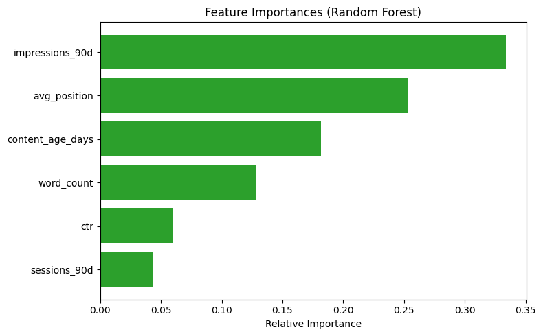

# Detecting SEO Traffic Decay: A Machine Learning Approach to Content Opportunity Scoring

## 1. Abstract
Organic search traffic is dynamic, but distinguishing between normal seasonal variance and structural content decay is a costly challenge for SEO and editorial teams. Content teams operate with limited capacity and cannot manually rewrite every page that ages past a certain date. Currently, teams rely on rigid, heuristic rules which flag an unmanageable volume of stable pages, resulting in wasted manual review hours. This research investigates whether a machine learning classifier can prioritize content refresh opportunities more effectively than rule-based heuristics. Using a Random Forest classifier trained on 79 million rows of search performance data, the model achieved a Precision@50 of 0.580, successfully outperforming the heuristic baseline of 0.380. This model serves as a decision-support tool to rank the editorial review queue, ensuring human time is spent on pages with the highest directional risk of traffic decay.

## 2. Introduction & Problem Statement
In the highly competitive landscape of organic search, content decay is inevitable. However, identifying *which* pages actually require intervention is a bottleneck. Standard industry practices rely on heuristic rules (e.g., flagging a page for review simply because it is old and receives impressions). These heuristics fail to account for the nuance of search behavior and frequently flag pages experiencing normal macro-seasonality. 

This creates a high false-positive rate. When editors are forced to manually audit hundreds of stable pages, genuine opportunities for traffic recovery are missed. The objective of this capstone is to replace rigid heuristics with a predictive machine learning model. By transforming raw search data into a ranked list of high-probability decay candidates, this model serves as a decision-support engine to optimize content refresh workflows.

## 3. Data Collection and Processing
The data driving this analysis was sourced from the official FlyRank ML Internship dataset (`content_refresh_anonymized.csv`), containing a 79M-row warehouse sample slice of real-world search performance. 

### 3.1 Data Scope and Features
The dataset was configured with one row per pseudonymized content item (`content_id`). The model utilized observable historical metrics:
*   `content_age_days`
*   `impressions_90d`
*   `sessions_90d`
*   `avg_position`
*   `ctr`
*   `word_count`

### 3.2 Public Safety and Leakage Prevention
Internal product flags (like `health_score` or `action_type`) were strictly dropped prior to training to prevent target leakage. Furthermore, raw client names, specific URLs, and private search queries were excluded upstream for complete public safety and privacy compliance.

## 4. Methodology
The core machine learning task was framed as a classification problem: predicting whether a given URL is experiencing structural traffic decay.

### 4.1 Target Label and Baseline
*   **Target Label Definition:** A proxy target variable `is_declining` was assigned a value of 1 if the historical `trend_direction` was marked as "down".
*   **Baseline Heuristic:** The legacy rule-based baseline flagged a page for review if it was both stale (>= 180 days old) and high-volume (>= 500 impressions).

### 4.2 Algorithm and Validation Design
A **Random Forest Classifier** (`max_depth=6`, `n_estimators=100`) was selected for its ability to map non-linear relationships (e.g., understanding that age matters more at position 3 than at position 40) and to output transparent feature importances.

To ensure strict leakage control, validation was structured using a `GroupShuffleSplit` (80/20 split) grouped by `client_id`. This ensured the model was evaluated on clients it had never seen, preventing it from artificially inflating metrics by memorizing a single client's site-wide penalty. Programmatic audits confirmed no future-window metrics leaked into the feature array.

## 5. Results and Evaluation
The models were evaluated using Precision@50 to answer a direct business question: *Of the top 50 pages the system recommends reviewing, how many were actually declining?*

*   **Baseline (Rules) Precision@50:** 0.380
*   **Random Forest Precision@50:** 0.580 (ROC AUC: 0.733)

The Random Forest model outperformed the rigid baseline significantly, successfully avoiding the "volume trap" where heuristics falsely flag stable, highly-trafficked seasonal pages simply because they are old. 

### Feature Importance
*(See the chart below for the relative importance of each feature in the model's decision-making process).*

## 6. Limitations and Honest Framing
While the model optimizes the discovery process, these results are observational and directional.
1.  **Observational, Not Causal:** We measured historical age and impression volume as directional signals. The model does not guarantee that a decline is actively happening, nor does it guarantee that rewriting the page will causally recover traffic.
2.  **Seasonality Blind Spots:** The model is blind to macroeconomic or seasonal intent shifts (e.g., traffic for winter apparel naturally dropping in spring).
3.  **Human Review Required:** This score must not trigger automated site changes, URL redirects, or zero-oversight Generative AI content rewrites.

## 7. Ranked Recommendations (The Action Playbook)
The model's continuous probabilities were translated into a discrete, actionable decision-support queue for reviewers, utilizing the following reason codes:

*   **Priority Refresh (Probability > 0.70):** Strong observed signals of decay. Top priority for human SERP review. 
    * *Reason Code:* `high_impr_decay_risk` (High risk on a high-visibility page) or `position_slip_risk` (Risk driven largely by falling average rank).
*   **Monitor & Expand (Probability 0.40 - 0.70):** Mixed signals. Monitor for the next 30 days.
*   **Stable (Probability < 0.40):** No action required.
    * *Reason Code:* `stale_but_stable` (Old content, but metrics hold steady).

## 8. Reproducibility
The full data pipeline, feature engineering logic, and modeling code can be reviewed in my GitHub repository:
[https://github.com/Tamur-Naseem/FLY-RANK](https://github.com/Tamur-Naseem/FLY-RANK)

## 9. Acknowledgments & Data Credit
Built on the FlyRank ML Internship dataset. Visit [https://flyrank.ai](https://flyrank.ai) to learn more.
